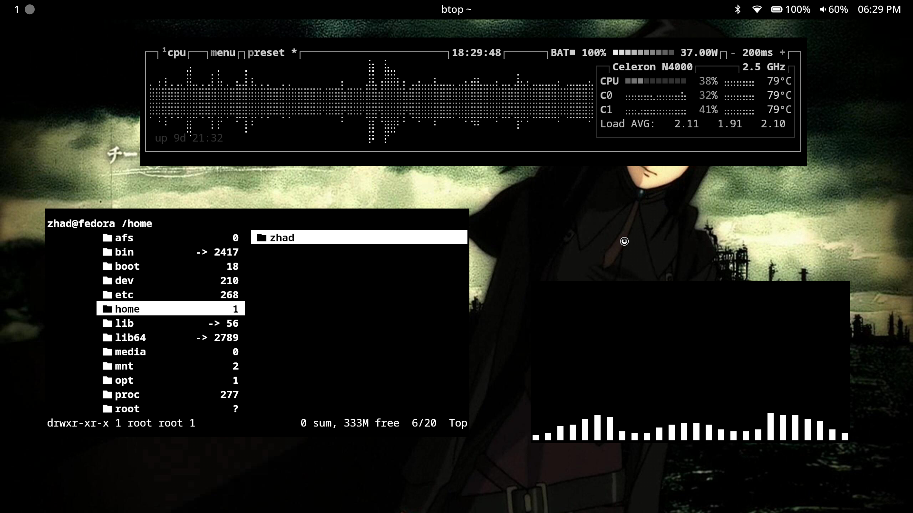

 

# Rice Shell

An auto rice shell script for i3-wm 

Supported on Arch Linux and Fedora

## Screenshots




## Installation

### 1. First you will have to clone the repository

```bash
git clone https://github.com/somniasum/r3sh ; cd r3sh 
```

### 2. Run the script as sudo
```bash
sudo ./install.sh 
```
Logout and log back in for the changes to take effect
